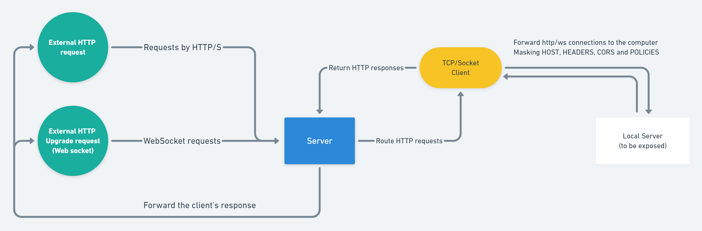

# CGNAT Tunnel
HTTP and WebSocket tunnelling


Easy and open-source solution for exposing a computer into the internet

## Why?
I made the project for a personal reason, I needed to expose a HomeAssistant server running on a Raspberry Pi. But due to restraints with Alexa and AWS Lambda, it needed to be a constant non-changing address/subdomain.
Of which, I couldn't get with NGROK(free) neither LocalTunnel(Providing a subdomain only worked for some hours).

It supports both HTTP and WebSocket transports.

**TL;DR; If you need to expose a server, for free with a fixed url, you can use this project and a free hosting (like heroku) to do it.**

## How it works?

The server acts as a normal HTTP/WS server, receiving requests.

The client connects with the server at `REMOTE_HOST` address.

Every HTTP request coming to the server will be forwarded to the connected client.

Every WS connection coming to the server will be forwarded to the connected client, and it's events as well (Messages, Connect, Disconnect).

All the requests forwarded to the client will be made at the client-level towards the `LOCAL_HOST` address, and their responses will be forwarded to the server.



## Server

The source-code of the server, responsible for routing the requests incoming from the internet to the connected clients.

### Running

To run the server simply execute the 'main.js' file

```sh
cd server
node "./src/main.js"
```

### Configuration

These properties bellow are fetched from Environment variables,
Therefore you can use a `.env` file at the project root `/server/.env` or define them into the system.

|Option|Type|Default|Description|
|--|--|--|--|
|PORT|Integer|3000|Specifies the port on which the server will run|
|SECRET|String|*Required*|Specifies a secret path to share with the client|
|DEBUG|Boolean|false|Enables verbose logging|
|AUTO_SLEEP|Integer|0|The amount of minutes in idle to shutdown the server (0 meaning no auto_sleep). *Useful in heroku free dynos*|


## Client

The source-code of the client, responsible for routing the requests incoming from the server.

### Running

To run the server simply execute the 'main.js' file

```sh
cd client
node "./src/main.js"
```

### Configuration

These properties bellow are fetched from Environment variables,
Therefore you can use a `.env` file at the project root `/server/.env` or define them into the system.

|Option|Type|Default|Description|
|--|--|--|--|
|SECRET|String|*Required*|Specifies a secret path to share with the server|
|HOST|String|*Required*|The ip/hostname of the server in the internet|
|LOCALHOST|String|*Required*|The ip/hostname to route all the incoming requests from the server. |
|DEBUG|Boolean|false|Enables verbose logging. *AKA the localhost:PORT*|
|REMOTE_PROTOCOL|*http* or *https*|http|Specifies the protocol to establish connection with the server|
|LOCAL_PROTOCOL|*http* or *https*|http|Specifies the protocol to establish connection with the local server|
